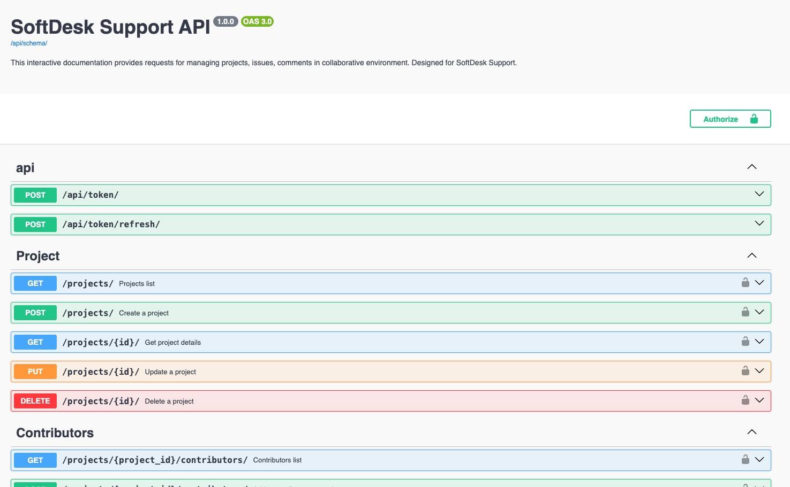

# SoftDesk Support

## Version
1.0.0

## Overview
This project consists of building a secure RESTful API, provides a robust 
system of managing projects, issues and comments in collaborative 
environment. It is designed for SoftDesk Support and enables users to track, 
create, and manage ressources efficiently.

The API has been developed using Django REST Framework, following:
- OWASP security best practices
- GDPR compliance rules
- Green code principles
- Secure authentication using JWT
- Fine-gained permission management per user

## Prerequisites
Before starting, make sure you have installed:
- Python ≥ 3.10
- Git
- Pipenv (to install it if needed `pip install pipenv`)

## Installation
1. Clone the project with the command:`git clone https://github.com/GitDrinou/DA_Python_P10_Softdesk_support.git`
2. Install dependencies with pipenv: `pipenv install`. This command will 
   create a virtual environment and install all dependencies listed in 
   **Pipfile**
3. Activate the virtual environment: `pipenv shell`
4. Apply database migrations: `python manage.py migrate`

## Launch the API
Start the server: `python manage.py runserver`

## Authentication
The API uses JWT (Json Web Token) authentication.

All protected routes require an: `Authorization Bearer Token`

## API Documentation
The API can be manually tested with Swagger UI.

The interactive documentation displays the list of requests to verify 
authentication, permissions, and core features.

To access to the documentation:
1. Launch the server on terminal `python manage.py runserver`
2. go to the documentation at http://127.0.0.1:8000/api/docs/

Now you can test the different endpoints.

## Running unit tests
To run all unit tests: `python manage.py test`

## Code style and linting
This project follows the PEP8 coding style and uses flake8 as a linting tool 
to maintain code quality.

To launch and check the flake8 report:
1. open your terminal and go the application's root directory
2. execute the following command: 'flake8'

If the code is not valid, you will see a list of errors.
